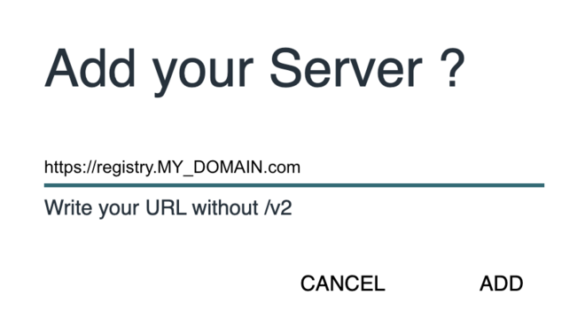

## Install Registry Dashboard
```shell
$ mkdir -p $HOME/temp/docker-registry-ui
$ git clone https://github.com/Joxit/docker-registry-ui.git $HOME/temp/docker-registry-ui

$ helm upgrade --install docker-registry-ui \
    --namespace container-registry \
    --set registry.external=true \
    --set registry.url=https://registry.k8s-example.com \
    --set ui.title="Docker Registry UI" \
    --set ui.replicaCount=1 \
    --set ui.nodeSelector.node-type=master \
    --set ui.image.tag=main \
    --set ui.delete_images=true \
    --set ui.ingress.enabled=false \
    --set ui.proxy=false \
    $HOME/temp/docker-registry-ui/examples/helm/docker-registry-ui
    
# Make sure docker-registry-ui pod is running
$ kubectl get pods --namespace container-registry | grep docker-registry-ui
#docker-registry-ui-ui-f4c595887-rrrbt   1/1     Running   0          32s

$ ./generate_user_password.sh
#$ ls ${HOME}/temp/registry-ui-creds
##htpasswd  registry-ui-pass.txt  registry-ui-user.txt
#$ cat ${HOME}/temp/registry-ui-creds/registry-ui-user.txt
#$ cat ${HOME}/temp/registry-ui-creds/registry-ui-pass.txt
#$ cat ${HOME}/temp/registry-ui-creds/htpasswd
```
## Create a Kubernetes secret to be used for dashboard access
```shell
$ kubectl create namespace container-dashboard
$ kubectl create secret generic docker-registry-ui-secret \
    --from-file=$HOME/temp/registry-ui-creds/htpasswd \
    --namespace container-dashboard
#secret/docker-registry-ui-secret created

$ kubectl get secret docker-registry-ui-secret --namespace container-dashboard
#NAME                        TYPE     DATA   AGE
#docker-registry-ui-secret   Opaque   1      22s

$ kubectl apply -f registry-ui.yaml
#ingressroute.traefik.containo.us/docker-registry-ui created
#middleware.traefik.containo.us/docker-registry-ui-auth created
```

## Set a hosted name registry-ui.MY_DOMAIN.com on a client machine (laptop/desktop)
```shell
$ kubectl get svc -n traefik
#NAME      TYPE           CLUSTER-IP      EXTERNAL-IP     PORT(S)                      AGE
#traefik   LoadBalancer   10.98.112.140   172.16.16.102   80:31944/TCP,443:30864/TCP   3h11m

# Edit the file using `sudo /etc/hosts`
# for windows: C:\Windows\System32\drivers\etc
# Append manualy to the existing k3s hosted name
172.16.16.102 kmaster, registry-ui.k8s-example.com

# Alternatively, add a new hosted name entry with a one-liner
$ echo -e "172.16.16.102\tregistry-ui.k8s-example.com" | sudo tee -a /etc/hosts

# go to: https://registry-ui.k8s-example.com/
```
## Add the server as a new.
https://registry.k8s-example.com


## (Optional) Uninstall Registry Dashboard
```shell
#Remove docker-registry-ui from the cluster
$ helm uninstall docker-registry-ui --namespace container-registry
```
